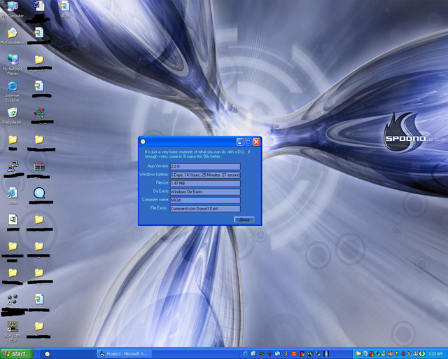



## Extream simple make and use of DLL's

### Description

If you are looking for simple, then i don't know how much more simple this CAN be to create and use a dll in your project for much easier use. This project just uses a few API calls as for what i have it to, but i will bet anyone can learn how to make and use dll's in just a few minutes. If i get a lot of positive feedback on this i will create much, much more to this CURRENT dll that i have started. Love to know if i have helped you. If so, i might start creating tutorials
 
### More Info
 

             |
---                |---
**Submitted On**   |2002-04-30 03:20:14
**By**             |[Patrick G](https://github.com/Planet-Source-Code/PSCIndex/blob/master/ByAuthor/patrick-g.md)
**Level**          |Advanced
**User Rating**    |4.8 (53 globes from 11 users)
**Compatibility**  |VB 6\.0
**Category**       |[Coding Standards](https://github.com/Planet-Source-Code/PSCIndex/blob/master/ByCategory/coding-standards__1-43.md)
**World**          |[Visual Basic](https://github.com/Planet-Source-Code/PSCIndex/blob/master/ByWorld/visual-basic.md)
**Archive File**   |[Extream\_si775054302002\.zip](https://github.com/Planet-Source-Code/patrick-g-extream-simple-make-and-use-of-dll-s__1-34241/archive/master.zip)

